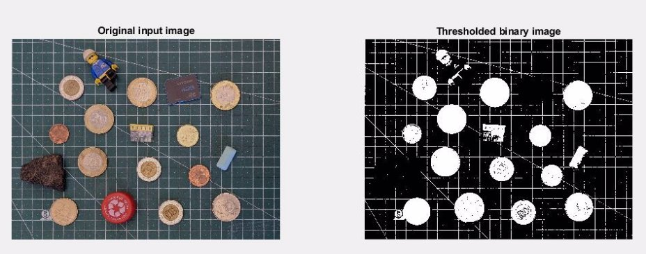
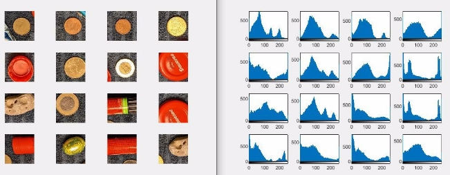

Assignment 1

Basic Image Processing Fall 2021

General rules

This is the first Assignment. There will be three more Assignments during the semester.

Point value: **20 points**, which is 20% of the total assignment points. Deadline: **October 4, 2021 23:59:59** (late submission until Oct. 6)

This is a not-guided exercise. The description of this assignment is general and does not focus on the details as in case of the Lab exercises.

The main task is to provide a good, reasonable solution. You may code “freely” (only minimal restrictions on file names and outputs are given).

Problem formulation

You have to write a custom coin detector and identifier program that can work on different images with very good confidence.

**Input:**  an image showing HUF and EUR coins and other stuff **Output:**  figures and console output (total amount for each currency)

Tasks to do

Write a script that…

1. loads the sample image into a variable,
1. applies histogram operations (e.g. stretching) to enhance quality
1. applies thresholding in color spaces to get a binary mask of objects
1. applies a coin detecting conv. kernel to find the round objects only
1. crops the round objects from the image one-by-one
1. decides for each round object whether it is a coin or not
1. if the object is a coin, quantize its value based on color and diameter
1. sums up the coin values for all the coins
1. returns the two summed values (Forint and Euro separately).

Key results to be presented:

You may code freely, as there are no restrictions on what functions, variable names and processing flow to use.

However, please create the following outputs:

1. **Figure 1** should show the original and binary image side-by-side
1. **Figure 2** should show the result of the convolution
1. **Figure 3** should show the cropped round objects, and for each subfigure the title says whether the object is a coin or not
1. **Figure 4** should show a similar image to Fig. 3 but with the coins only, showing their determined value
1. The answer (total amount) should be displayed on the **console**

6
Figure 7

7
Figure 3

8
Figure 4

9

The console output:

10

There is no code package for this assignment.

All scripts and functions must be written entirely by you.

Download the image to be processed from here:

<https://beta.dev.itk.ppke.hu/bipa/assignment_01> 

11

Submission & hints

You should create a script named a01\_NEPTUN.m where the NEPTUN part is your Neptun ID. This has to be the main script; running that must be able to solve the problem.

You are allowed to create other files (e.g. additional functions) too, if necessary.

Please submit ALL files (including the image as well) in a compressed **ZIP** file via the Moodle system.

**Check the upcoming slides for hints!**

12
Hint 1

Stretch the histogram of the image to the full dynamic range. Use thresholding on separate color channels and combine the results (with logical operations) to get a decent mask.

A mask with large white areas in non-coin objects will cause problems.

Aim for a mask that is white in the coin regions but has “holes” in the unwanted parts.

If the mask is “noisy” (small white dots) it’s not a problem, the convolution will deal with it.

13
Hint 2

The “coin-detection kernel” should be a round kernel with a diameter comparable to the smallest coin. 

Something like this will do: 

(The size of a good kernel might be different in your case.) 

Use the MATLAB’s built-in kernel generator function to obtain such matrix.

14
Hint 4

Cropping the objects may sound hard but it isn’t.

Define a window size that is large enough to contain the whole coin.

Find the location of the maximum in the convolved image, and crop the window-sized area around the same spot in the original, color image.

Modify the result of the convolution; replace every value inside the window with 0. This will destroy the now-found maximum and the next iteration will find the next max value, possibly a new coin for which the kernel shows significant activation.

Stop the loop when the value of the maximum is not significant anymore.

15
Hint 6

The histogram of the cropped color image can be useful to decide whether it’s a coin or not. Use the total number of pixels in the “interesting” regions; 

E.g. if an image has 50% of its pixels between 0 and 20 intensity => coin.

(The values are not accurate in this example; it’s just here to illustrate the idea.)

 16

Hint 7

You have to build a so-called “look-up-table” in which you store the coin diameters associated with their values.

Create it manually by measuring the diameters of the coins in the original image. Allow some error margin. The result should be a set of boundary values and an associated value belonging to that interval of diameters.

E.g. (not real values, just an example!)

If 152 < d < 160  then   5 Ft If 165 < d < 178 then  10 Ft If  190 < d < 200 then 20 Ft etc....

17
Hint 8

It might also be beneficial to include color info in the look-up-table as well: E.g. (not some real values, just an example!)

If 152 < d < 160  AND  red > 200 then   2 cent If 152 < d < 160  AND  red < 170 then   5 Ft etc...

18
Hint 9

Use the diameter and color of the coin to get its value. Consider the line of pixels along the center of the window (both horizontally and vertically). Try to detect the huge jump in the pixel value; find the location of these points and calculate the distance between them. This is the diameter of the coin. Compare the diameters along the two axes; they should be very close to each other in value. Check the color of the coin within this interval too!

19

Grading

The final score of this assignment is the sum of the following points:

The script filename is correct, it’s a script, the image is loaded, no errors 2 points Figure 1 exists, similar to the sample in this document, mask is good 2 points Convolution kernel exists, size and kernel values are OK 1 point Figure 2 exists, similar to the sample in this document, result is good 2 points Object cropping is done in a loop with a window, at least 70% found 3 points Coin or not-coin detection working correctly (>70% classified correctly) 2 points Figure 3 exists, similar to the sample in this document 2 points Look up table (or an if-else structure) of coin values exists and looks good 2 points Figure 4 exists, similar to the sample in this document 1 point Console output exists, the sum is OK according to Fig. 4 1 point Code quality (readability, understandability, good comments and structure) 2 points

**TOTAL:**      **20 points** 20

Contact

If you have any further questions regarding this assignment, contact

**Márton Bese NASZLADY** 

via **Teams** (in private chat) or write an email to naszlady@itk.ppke.hu

21

**THE END**
22
